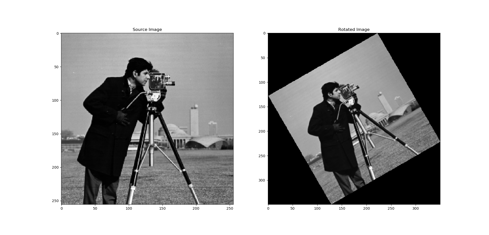
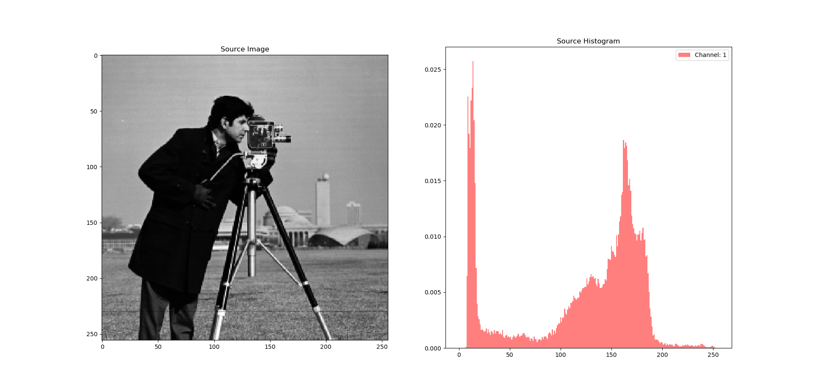
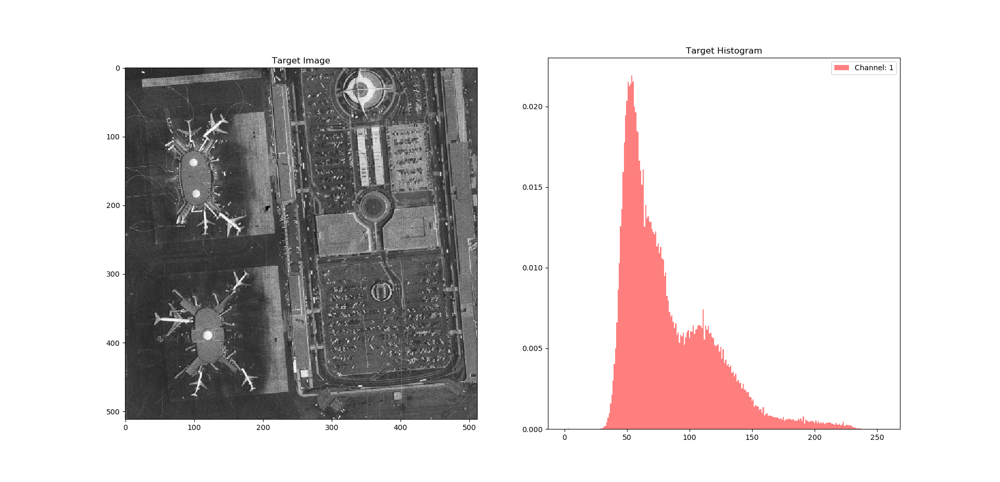
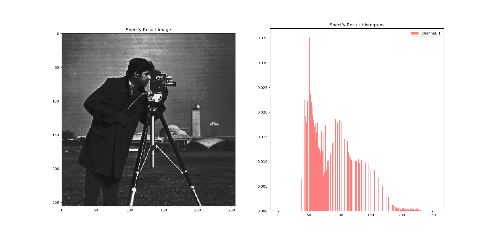
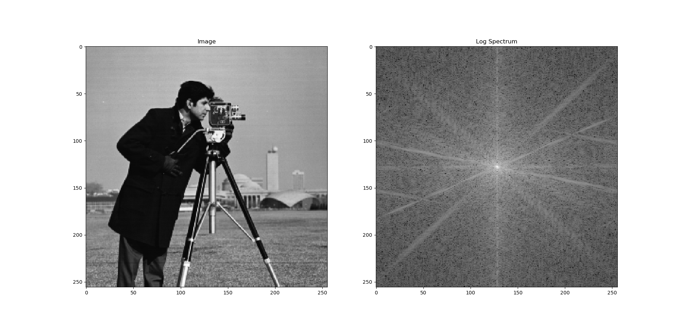
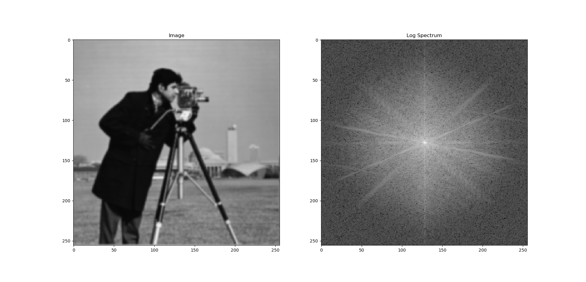
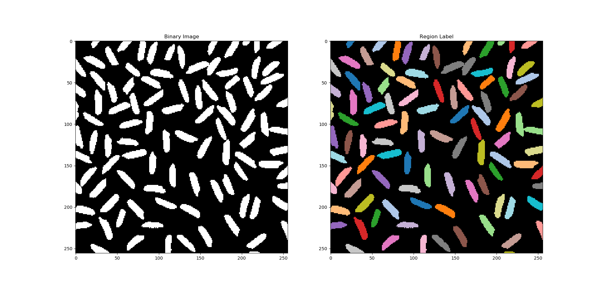
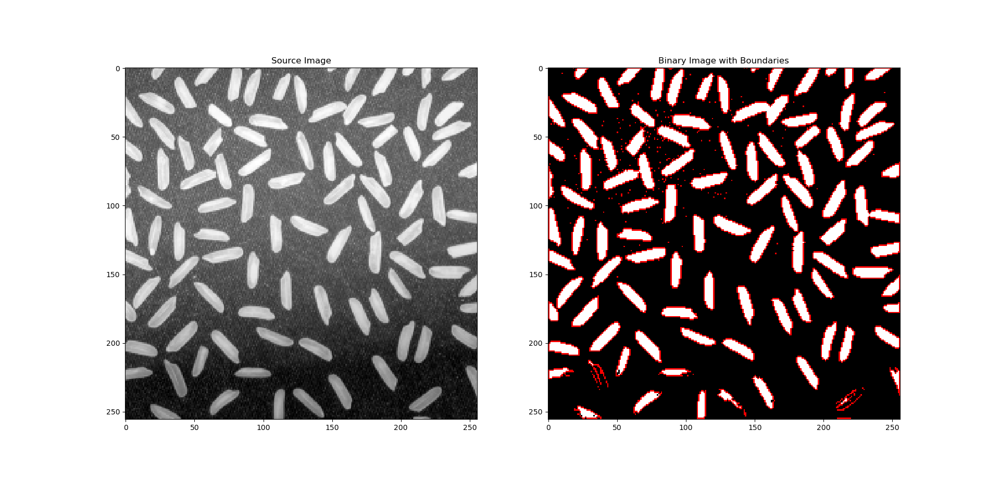

- [数字图像处理课程作业](#数字图像处理课程作业)
  - [环境搭建](#环境搭建)
    - [安装Anaconda](#安装anaconda)
    - [安装依赖环境](#安装依赖环境)
    - [启用环境](#启用环境)
  - [函数功能](#函数功能)
    - [图像旋转](#图像旋转)
    - [直方图规定化](#直方图规定化)
    - [傅里叶滤波](#傅里叶滤波)
    - [区域标记](#区域标记)
    - [边界跟踪](#边界跟踪)
    - [空域滤波](#空域滤波)

# 数字图像处理课程作业

## 环境搭建

### 安装Anaconda

Anaconda 是一个用于科学计算的 Python 发行版，支持 Linux, Mac, Windows，包含了众多流行的科学计算、数据分析的 Python 包。
下载地址为: <https://www.anaconda.com/distribution/>

请根据自己的平台下载并安装适用于 Python3 版本的 Anaconda。参考: [Anaconda安装及使用文档](https://docs.anaconda.com/anaconda)

安装成功后，Windows 平台可开启 "Anaconda Prompt"，或打开 cmd/Powershell，Linux/macOS 可直接开启终端。
进入命令行界面后输入

```shell
conda --version
```

若出现对应版本号则证明安装成功.


### 安装依赖环境

在 Windows 系统下，进入命令行界面并将当前目录设为工作目录后，可运行以下命令构建运行环境

```shell
conda env create -f environment-windows.yaml
```

在 Linux 系统下，进入命令行界面并将当前目录设为工作目录后，可运行以下命令构建运行环境

```shell
conda env create -f environment-windows.yaml
```

若看到下列信息，则表明环境安装成功。

```shell
Preparing transaction: done
Verifying transaction: done
Executing transaction: done
#
# To activate this environment, use
#
#     $ conda activate imageProcess
#
# To deactivate an active environment, use
#
#     $ conda deactivate
```

注: 开发所用系统包括 Windows 10 与 Ubuntu 18.04，其他系统可能存在问题

### 启用环境

环境安装成功后，可通过 `conda activate imageProcess` 启用该环境，启用成功后将看到 `(imageProcess)` 出现在命令行的行首。

## 函数功能

### 图像旋转

源文件: [PyImageProcess/image_rotate.py](PyImageProcess/image_rotate.py)

用法:

```shell
usage: image_rotate.py [-h] image_path rotate_angle {bilinear,nearest}

将给定图像进行逆时针旋转变换

positional arguments:
  image_path          待处理图像的地址
  rotate_angle        图像旋转的角度, 单位为度(°)
  {bilinear,nearest}  选用的差值方式, 双线性差值: bilinear, 和最近邻差值: nearest

optional arguments:
  -h, --help          show this help message and exit
```

示例:

```shell
python PyImageProcess/image_rotate.py images/camera.tiff 30 bilinear
```

结果:



### 直方图规定化

源文件: [PyImageProcess/histogram_specigy.py](PyImageProcess/histogram_specigy.py)

用法:

```shell
usage: histogram_specify.py [-h] [-s SOURCE_PATH] [-t TARGET_PATH]
                            {equalize,specify}

将给定图像进行直方图均衡化或正规化

positional arguments:
  {equalize,specify}    指定处理任务, 直方图均衡化: equalize, 或直方图规定化: specify

optional arguments:
  -h, --help            show this help message and exit
  -s SOURCE_PATH, --source_path SOURCE_PATH
                        源图像地址
  -t TARGET_PATH, --target_path TARGET_PATH
                        目标图像地址
```

示例:

```shell
python PyImageProcess/histogram_specify.py specify -s images/camera.tiff -t images/lax.tiff
```

结果:







### 傅里叶滤波

源文件: [PyImageProcess/fourier_filter.py](PyImageProcess/fourier_filter.py)

用法:

```shell
usage: fourier_filter.py [-h] -f {low_pass,high_pass,kernel}
                         [-k {average,gaussian,laplacian}] [-w WIDTH]
                         image_path

对给定的图像进行傅里叶滤波, 图像读取时透明度维度将被忽略

positional arguments:
  image_path            待处理图像的地址

optional arguments:
  -h, --help            show this help message and exit
  -f {low_pass,high_pass,kernel}, --filter {low_pass,high_pass,kernel}
                        选择傅里叶滤波器类别, low_pass: 简单的频域低通滤波 (圆形mask), high_pass:
                        简单的频域高通滤波 (圆形mask), kernel: 使用给定的空域kernel进行傅里叶滤波
  -k {average,gaussian,laplacian}, --kernel {average,gaussian,laplacian}
                        选择空域kernel类别, 当--filter不为'kernel'时该项设置无效. average:
                        邻域平均模板, 形状为7x7, gaussian: 高斯模板, 形状为7x7, sigma为1,
                        laplacian: 拉普拉斯模板, 形状为3x3, 注意: kernel具体参数暂时无法由命令行输入,
                        修改需自行编码
  -w WIDTH, --width WIDTH
                        简单低通/高通滤波器的mask宽度, 当--filter为 'kernel'时该项设置无效
```

示例:

```shell
python PyImageProcess/fourier_filter.py images/camera.tiff -f kernel -k gaussian
```

结果:





### 区域标记

源文件: [PyImageProcess/region_label.py](PyImageProcess/region_label.py)

用法:

```shell
usage: region_label.py [-h] [-n {4,8}] [-fg {0,255}] image_path

对给定的二值图像进行区域标记, 若给定图像并非二值图像, 则先根据全局阈值对其进行二值化处理 注意: 二值图像中默认 0 为背景, 255 为前景

positional arguments:
  image_path            待处理图像的地址

optional arguments:
  -h, --help            show this help message and exit
  -n {4,8}              考虑的邻接区域, 4-邻域或8-邻域, 默认为4
  -fg {0,255}, --foreground_value {0,255}
                        前景像素值, 默认为255
```

示例:

```shell
python PyImageProcess/region_label.py images/rice-bw.png
```

结果:



### 边界跟踪

源文件: [PyImageProcess/boundary_track.py](PyImageProcess/boundary_track.py)

用法:

```shell
usage: boundary_track.py [-h] [-n {4,8}] [-fg {0,255}] image_path

对给定的二值图像进行边界追踪(外边界), 若给定图像并非二值图像, 则先根据全局阈值对其进行二值化处理 注意: 二值图像中默认 0 为背景, 255 为前景

positional arguments:
  image_path            待处理图像的地址

optional arguments:
  -h, --help            show this help message and exit
  -n {4,8}              考虑的边界邻接区域, 4-邻域或8-邻域, 默认为8
  -fg {0,255}, --foreground_value {0,255}
                        前景像素值, 默认为255
```

示例:

```shell
python PyImageProcess/boundary_track.py images/rice.png
```

结果:



```python
Boundary 1
[(0, 18)]
Boundary 2
[(0, 21), (0, 22), (0, 23), (0, 24), (0, 25), (0, 26), (0, 27), (0, 28),
 (0, 29), (1, 28), (2, 27), (3, 27), (4, 26), (5, 25), (6, 24), (7, 23),
 (8, 22), (8, 21), (8, 20), (7, 20), (6, 19), (5, 19), (4, 19), (3, 19),
 (2, 20), (1, 20), (0, 21)]
Boundary 3
[(0, 57), (0, 58), (0, 59), (0, 60), (0, 61), (0, 62), (0, 63), (0, 64),
 (0, 65), (0, 66), (0, 67), (1, 67), (2, 66), (3, 65), (4, 64), (5, 63),
 (6, 63), (7, 62), (8, 61), (9, 60), (10, 59), (11, 58), (11, 57), (11, 56),
 (11, 55), (12, 54), (12, 53), (13, 52), (13, 51), (12, 50), (11, 50), (10, 50),
 (9, 51), (8, 51), (7, 52), (6, 53), (5, 53), (4, 54), (3, 55), (2, 56),
 (1, 57), (0, 57)]
Boundary 4
[(0, 78), (0, 79), (0, 80), (0, 81), (0, 82), (0, 83), (1, 84), (2, 84),
 (3, 84), (4, 84), (5, 84), (6, 84), (7, 84), (8, 84), (9, 84), (10, 84),
 (11, 83), (12, 83), (13, 83), (14, 83), (15, 83), (16, 83), (17, 82), (18, 82),
 (19, 82), (20, 82), (21, 82), (22, 81), (23, 80), (24, 81), (23, 80), (23, 79),
 (24, 78), (24, 77), (24, 76), (23, 75), (22, 75), (21, 74), (20, 74), (19, 74),
 (18, 74), (17, 74), (16, 75), (15, 75), (14, 75), (13, 75), (12, 76), (11, 76),
 (10, 76), (9, 76), (8, 76), (7, 77), (6, 77), (5, 77), (4, 77), (3, 77),
 (2, 78), (1, 78), (0, 78)]
Boundary 5
[(0, 87), (0, 88), (0, 89), (0, 90), (1, 89), (1, 88), (0, 87)]
```

### 空域滤波

源文件: [PyImageProcess/spatial_filter.py](PyImageProcess/spatial_filter.py)

用于生成不同的空域滤波模板, 暂未实现空域模板卷积运算。
文件主函数用于输出模板数据供测试用。

示例:

```shell
python PyImageProcess/spatial_filter.py
```

结果:

```python
Gaussian Kernel, shape: (3, 3)
[[0.07511361 0.1238414  0.07511361]
 [0.1238414  0.20417996 0.1238414 ]
 [0.07511361 0.1238414  0.07511361]]
Gaussian Kernel Gradients, shape: (3, 3)
HX:
 [[ 0.0487278   0.         -0.0487278 ]
 [ 0.08033855  0.         -0.08033855]
 [ 0.0487278   0.         -0.0487278 ]]
HY:
 [[ 0.0487278   0.08033855  0.0487278 ]
 [ 0.          0.          0.        ]
 [-0.0487278  -0.08033855 -0.0487278 ]]
Gaussian Kernel, shape: (2, 3)
[[0.13703431 0.22593138 0.13703431]
 [0.13703431 0.22593138 0.13703431]]
Gaussian Kernel Gradients, shape: (2, 3)
HX:
 [[ 0.08889707  0.         -0.08889707]
 [ 0.08889707  0.         -0.08889707]]
HY:
 [[0. 0. 0.]
 [0. 0. 0.]]
Average Kernel, shape: (3, 3)
[[0.11111111 0.11111111 0.11111111]
 [0.11111111 0.11111111 0.11111111]
 [0.11111111 0.11111111 0.11111111]]
Average Kernel, shape: (2, 3)
[[0.16666667 0.16666667 0.16666667]
 [0.16666667 0.16666667 0.16666667]]
Laplacian Kernel
[[ 0 -1  0]
 [-1  4 -1]
 [ 0 -1  0]]
 ```
