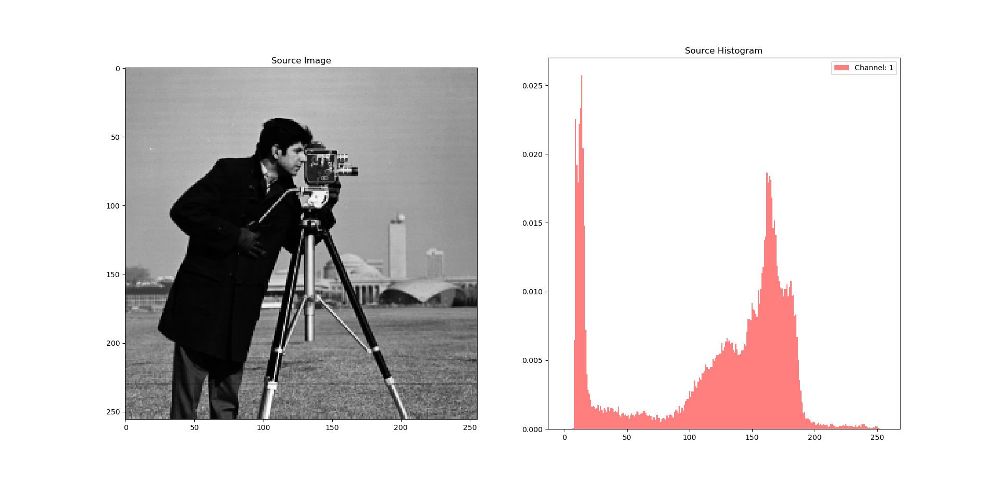
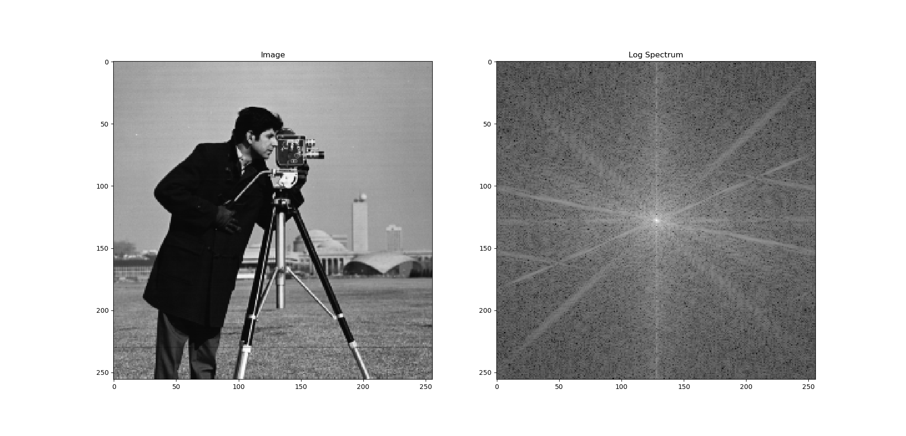

# 数字图像处理课程作业

**姓名**: 潘宣昊

**学号**: M201973359

---

**环境安装及函数用法**: 详见项目主目录下的`README.md`文件. 项目主页地址: <https://github.com/neo-pan/Digital_Image_Processing> 

---

## 2、图像旋转

>  设一幅大小为M×N的灰度图像I中，现要将其逆时针旋转 A度，得到图像J，请写出J的生成算法（要求使用近邻插值）。

执行命令:

```shell
python PyImageProcess/image_rotate.py images/camera.tiff 30 nearest
```

运行结果:


## 4、直方图规定化

> 设一幅大小为M×N的灰度图像 I 中，灰度为 g 的像素数为h(g)，$0\leq g\leq255$ 。另给定一个直方图t(g)，$0\leq g\leq255$。 请写出对图像 I 进行变换的方法，使得变换后的新图像的直方图与t相同（近似相等）。

执行命令:

```shell
python PyImageProcess/histogram_specify.py specify -s images/camera.tiff -t images/lax.tiff
```

运行结果:




## 14、基于傅里叶变换的低通滤波

> 基于频域的低通滤波

执行命令:

```shell
python PyImageProcess/fourier_filter.py images/camera.tiff -f kernel -k gaussian
```

运行结果:




## 18、 **区域标记** 

>  设有一幅二值图像（元素取值为0或1），请生成该图像的标记图像。（即第一个连通区域中的每一个白色像素的值都置为1，第二个连通区域中的每一个白色像素的值都置为2，依此类推。区域编号可不考虑顺序）

执行命令:

```shell
python PyImageProcess/region_label.py images/rice-bw.png
```

运行结果:


## 19、 边界跟踪

> 设一幅二值图像中，只有一个白色区域，试给出求该区域外围轮廓线的方法（要求按顺时针的顺序给出各点的坐标，即行/列号）。

执行命令:

```shell
python PyImageProcess/boundary_track.py images/rice.png
```

运行结果:


## 附加题

> 统计`rice.png` 中有多少颗米？

[matlab代码](count_rice.m)如下:

```matlab
clear;
close all;

I = imread('rice.png');
figure; imshow(I);
% 创建半径为12的圆盘形结构元
se = strel('disk',12);
% 用该结构元对图像进行顶帽操作
I_tophat = imtophat(I,se);
% 将图像根据其全局Otsu阈值二值化
bw = imbinarize(I_tophat,"global");
% 消除孤立的亮点
bw = bwmorph(bw,'clean');

% 对二值图像进行联通区域标记
[L, num] = bwlabel(bw);

figure; imshow(L,[]);
disp(['米粒的数量是:',num2str(num)]);
```

运行结果:


